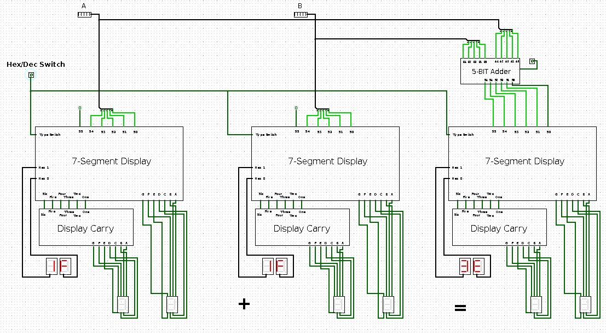
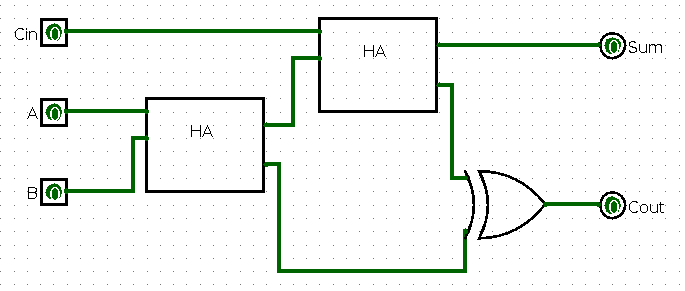
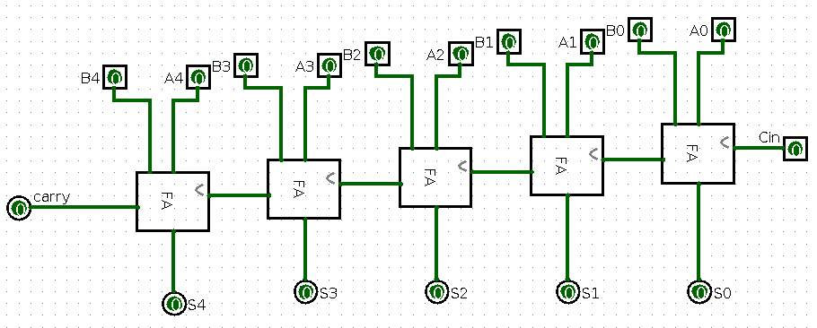
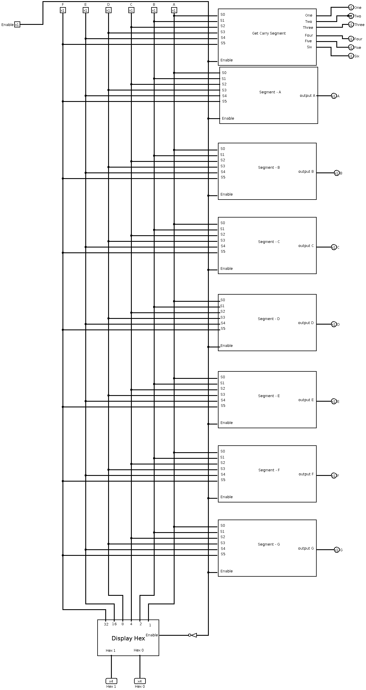
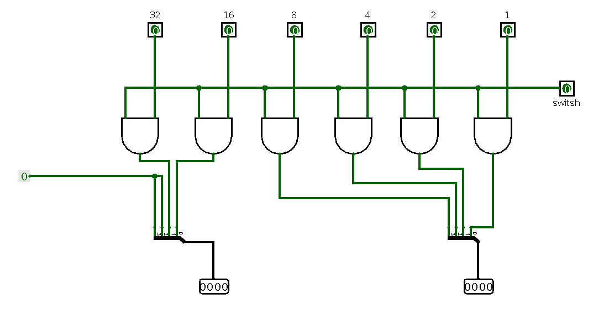
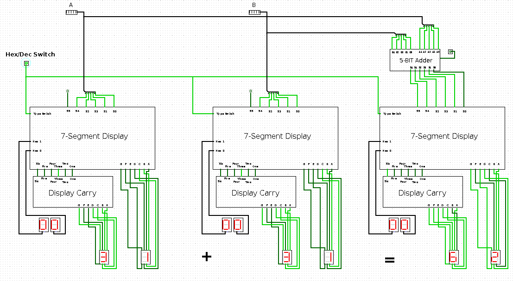

# 5-Bit Binary Adder with 7-Segment Display Control

[go to implementation :arrow_down:](#implementation)

## Abstract
This project implements a 5-bit binary adder system that performs
addition on two 5-bit binary numbers.

The results are displayed using a 7-segment display, and the
system supports a control bit to switch between decimal and hexadecimal representations for the inputs
and outputs.

## Problem Definition
The main objective of the project is to:
- Add two 5-bit binary numbers.
- Display the operands and result on a 7-segment display.
- Integrate a control unit for toggling between decimal and hexadecimal representation

## Requirements
[Logisim](http://www.cburch.com/logisim/download.html): Digital circuit simulation software.

---

## Team Members
1. [Ahmed M. Ezzeldeen](https://github.com/ahmed3zzeldeen/)
2. [Mostafa Khafgy](https://github.com/mostafaKhafgy)

---

## Task List

- [X] **Create the Full Adder Subcircuit** `Assign to` [Mostafa Khafgy](https://github.com/mostafaKhafgy)
- [X] **Create the 5-bit Full Adder Using the Full Adder Subcircuit**  `Assign to` [Mostafa Khafgy](https://github.com/mostafaKhafgy)
- [X] **Add 7-Segment Displays circuit** `Assign to` [Ahmed M. Ezzeldeen](https://github.com/ahmed3zzeldeen/) 
  - [X] Add 6x64 Decoder circuit from 4x16 Decoder circuits 
  - [X] Add 7-Segment Display circuit
  - [X] Segment - A, B, C, D, E, F, G 
  - [X] Add Get Segment carry to the next 7-Segment Display
  - [X] Add Display-Carry circuit
  - [X] Add Display-Hex circuit
- [X] **Add Control Bit for Decimal/Hexadecimal Switching** `Assign to` [Mostafa Khafgy](https://github.com/mostafaKhafgy)
- [X] **Logic for Display Mode** [Ahmed M. Ezzeldeen](https://github.com/ahmed3zzeldeen/)
- [X] **Connect Everything Together** `Assign to` [Ahmed M. Ezzeldeen](https://github.com/ahmed3zzeldeen/) and [Mostafa Khafgy](https://github.com/mostafaKhafgy)

let's start with the design of the Full Adder Subcircuit :smile: :fire: 

## Implementation

### 3.1 - 5 bit Adder Circuit
**The 5-bit adder was implemented using:**
- Half Adders (HA): Used for the least significant bit addition.
- Full Adders (FA): Used for the remaining bits to propagate carry.
- The final output is a 6-bit result, where the extra bit represents the
carry-out from the addition.

**Full Adder using 2 Half Adder**

**5 bit Adder using 4 Full Adder**

### 3.2 - 7-Segment Display
The display system was designed with the following approach:
- A separate circuit for each segment (A-G).
- OR gates used to combine the output of the 6X64 decoder for each
segment.
- Each segment is then combined into a master display system.

### 3.3 - Control Unit
The control unit uses enables to:
- Select between binary-to-decimal and binary-to-hexadecimal
conversions.
- Enable or disable specific outputs on the 7-segment display.

## Challenges Faced
- **Keymap for 6 inputs:**
  > Limited resources for keymap designs for 6-bit so decoders required using OR gates for manual mapping.
- **6X64 Decoder not exist by default in Logism:**
  > The absence of a built-in 6x64 decoder in Logisim necessitated designing a custom decoder circuit. This was achieved by combining smaller decoders (e.g., 3x8 decoders) and using additional logic gates to manage outputs effectively.
- **Complexity of 7-Segment Design:**
  > Mapping the outputs of the decoder to individual segments (A-G) involved extensive testing to ensure correct representation of numbers in both decimal and hexadecimal formats.

## Results
The project successfully achieves the following:
- [X] Accurate addition of 5-bit binary numbers.
- [X] Display of inputs and results in both decimal and hexadecimal formats.
- [X] Seamless switching using the control unit.

## Conclusion
This project demonstrates the effective use of Logisim for
designing and simulating digital systems.
The modular approach ensures scalability and clarity, while the
added functionality of a control unit enhances usability.

_and thank you for your time._

***Project Team Members :heart:***
- [Ahmed M. Ezzeldeen](https://github.com/ahmed3zzeldeen/)
- [Mostafa Khafgy](https://github.com/mostafaKhafgy)

